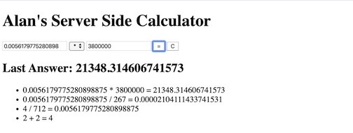

Server Side Calculator

This is a calculator and ledger useful for repeatedly performing basic arithmetic and reviewing the results at a glance.

<!-- photo goes here -->

Calculations are performed to a vey high level of accuracy on the sever for added security but the results are stored and made available to all so that teams can easily work together from a single data set.

<!-- photo goes here -->

Calculations are all stored until server reset allowing maximum time to review and detect errors.
